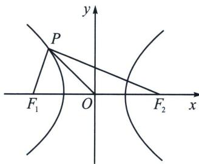

<!-- question-source:start -->
例8（2024·德阳模拟）设 $F_{1}$ 、 $F_{2}$ 是双曲线 $C: \frac{x^{2}}{a^{2}} - \frac{y^{2}}{b^{2}} = 1 (a > 0, b > 0)$ 的左、右焦点， $O$ 是坐标原点，点 $P$ 是 $C$ 上异于实轴端点的任意一点，若 $|PF_{1}| \cdot |PF_{2}| - |OP|^{2} = 2a^{2}$ ，则 $C$ 的离心率为（）
A. $\sqrt{3}$ B. $\sqrt{2}$ C. 3
D. 2

<!-- question-source:end -->

![[高中/总复习/专题/2026版高中《mst老唐说题》圆锥曲线专题（数学）/上册/第01章_圆锥曲线四定义/第二节_椭圆双曲的比值模型_第二定义/三_第二定义与_PF__1__cdot_PF__2__相关的结论/例题/answers/Q00048338A1.md]]
