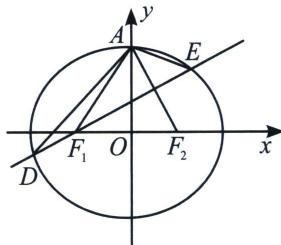

<!-- question-source:start -->
例4 (2022·新高考1)已知椭圆 $C: \frac{x^{2}}{a^{2}} + \frac{y^{2}}{b^{2}} = 1 (a > b > 0)$ , $C$ 的上顶点为 $A$ , 两个焦点为 $F_{1}, F_{2}$ , 离心率为 $\frac{1}{2}$ , 过 $F_{1}$ 且垂直于 $AF_{2}$ 的直线与 $C$ 交于点 $D, E$ 两点, $|DE| = 6$ , 则 $\triangle ADE$ 的周长是 \_\_\_\_.

<!-- question-source:end -->

![[高中/总复习/专题/2026版高中《mst老唐说题》圆锥曲线专题（数学）/上册/第01章_圆锥曲线四定义/第二节_椭圆双曲的比值模型_第二定义/二_双曲线第二定义关于_比_/例题/answers/Q00048332A1.md]]
