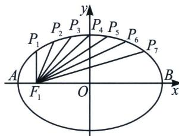

<!-- question-source:start -->
例5 (2023·南通二模)弓琴(左图), 也可称作“乐弓”, 是我国弹弦乐器的始祖. 古代有“后羿射十日”的神话, 说明上古生民对善射者的尊崇, 乐弓自然是弓箭发明的延伸. 在我国古籍《吴越春秋》中, 曾记载着: “断竹、续竹, 飞土逐肉”. 弓琴的琴身下部分可近似的看作是半椭球的琴腔, 其正面为一椭圆面, 它有多条弦, 拨动琴弦, 音色柔弱动听, 现有某研究人员对它做出改进, 安装了七根弦, 发现声音强劲悦耳. 右图是一弓琴琴腔下部分的正面图. 若按对称建立如图所示坐标系, $F_{1}(-c, 0)$ 为左焦点, $P_{i}(i=1, 2, 3, 4, 5, 6, 7)$ 均匀对称分布在上半个椭圆弧上, $P_{i}F_{1}$ 为琴弦, 记 $a_{i}=|P_{i}F_{1}| (i=1, 2, 3, 4, 5, 6, 7)$ , 数列 $\{a_{n}\}$ 前 $n$ 项和为 $S_{n}$ , 椭圆方程为 $\frac{x^{2}}{a^{2}}+\frac{y^{2}}{b^{2}}=1$ , 且 $a+64c=4ac$ , 则 $S_{7}+a_{7}-128$ 取最小值时, 椭圆的离心率为 \_\_\_\_.

<!-- question-source:end -->

![[高中/总复习/专题/2026版高中《mst老唐说题》圆锥曲线专题（数学）/上册/第01章_圆锥曲线四定义/第二节_椭圆双曲的比值模型_第二定义/二_双曲线第二定义关于_比_/例题/answers/Q00048333A1.md]]
