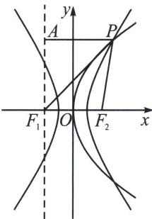

> [!faq]- 《圆锥曲线专题(上册)》例题解析
>
> > [!success]- **【答案】** A
>
> > [!note]- **【解析】**
> > 解析 解法一：根据题意可设 $F_{2}\left(\frac{p}{2},0\right)$ ，双曲线的半焦距为 $c$ ， $P(x_0,y_0)$ ，则 $p = 2c$ ，过 $F_{1}$ 作 $x$ 轴的垂线 $l$ ，过 $P$ 作 $l$ 的垂线，垂足为 $A$ ，显然直线 $AF_{1}$ 为抛物线的准线，则 $\vert PA\vert = \vert PF_2\vert$ ，由双曲线的定义及已知条件可知 $\left\{ \begin{array}{l} \vert PF_1\vert -\vert PF_2\vert = 2a\\ \vert PF_1\vert +\vert PF_2\vert = 6c \end{array} \right.$ ，则 $\left\{ \begin{array}{l}\vert PF_1\vert = 3c + a\\ \vert PF_2\vert = 3c - a = \vert PA\vert \end{array} \right.$ ，由勾股定理可知 $\vert AF_1\vert^2 = y_0^2 = \vert PF_1\vert^2$ $-\vert PA\vert^2 = 12ac$ ，易知 $y_0^2 = 4cx_0$ ，所以 $x_0 = 3a$ ，即 $\frac{x_0^2}{a^2} -\frac{y_0^2}{b^2} = \frac{9a^2}{a^2} -\frac{12ac}{c^2 - a^2} = 1$ ，整理得 $2c^{2} - 3ac - 2a^{2} = 0 = (2c + a)(c - 2a)$ ，所以 $c = 2a$
> >
> > 
> >
> > 解法二：利用焦半径公式， $|PF_{2}| = ex_{P} - a = \frac{p}{2a} x_{P} - a = x_{P} + \frac{p}{2}, |PF_{1}| = ex_{P} + a = \frac{p}{2a} x_{P} + a, |PF_{1}| + |PF_{2}| = 3|F_{1}F_{2}| \Rightarrow \frac{p}{a} x_{P} = 3p \Rightarrow x_{P} = 3a$ ，所以 $|PF_{2}| = \frac{p}{2a} x_{P} - a = x_{P} + \frac{p}{2} \Rightarrow \frac{3}{2} p = 4a + \frac{p}{2} \Rightarrow p = 2c = 4a$ ，所以 $c = 2a$ ，即离心率为2．
> >
> > 故选 **A**.
