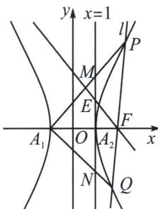

<!-- question-source:start -->
例4 (2025年福建省厦门市高考数学第二次质检18题(25陪跑课学员博方提问))已知双曲线 $C: \frac{x^2}{a^2}$ $\frac{y^2}{b^2} = 1 (a > 0, b > 0)$ 的左、右顶点分别为 $A_1, A_2$ ，过 $C$ 的右焦点 $F(2, 0)$ 的直线 $l$ 与 $C$ 的右支交于 $P$ ， $Q$ 两点。当 $l$ 与 $x$ 轴垂直时， $\angle PA_1 F = \frac{\pi}{4}$ 。

(1) 求 C 的方程;

(2) 直线 $A_{1}P$ ， $A_{1}Q$ 与直线 x=1 的交点分别为 M，N，E 为 $A_{2}M$ 的中点.

(i) 求 $\left| MN \right|$ 的最小值；

(ii) 证明：点 $A_{2}$ 关于直线 $EF$ 对称的点在 $l$ 上.

(1) 因为 $C: \frac{x^2}{a^2} - \frac{y^2}{b^2} = 1$ ，令 $x = c$ ，可得 $y = \pm \frac{b^2}{a}$ ，因此当 $l$ 与 $x$ 轴垂直时， $|PF| = \frac{b^2}{a}$ 。根据 $\angle PA_1F = \frac{\pi}{4}$ ，可得 $|A_1F| = |PF|$ ，所以 $a + c = \frac{b^2}{a} = \frac{c^2 - a^2}{a}$ ，因此 $c = 2a$ ，因为 $F(2,0)$ ，所以 $c = 2, a = 1, b = \sqrt{4 - 1} = \sqrt{3}$ ，因此 $C: x^2 - \frac{y^2}{3} = 1$ 。

(2)如图, 易知 $k_{A_1P} k_{A_1Q} =$ 定值 (顶点角 + 第三条边为轴点弦), 采用齐次化证明, 将双曲线按照向量 $\overrightarrow{A_1O}$ : (1, 0)

平移， $(x - 1)^2 - \frac{y^2}{3} = 1$ ，即 $x^2 - \frac{y^2}{3} - 2x = 0$ ，令 $P \to P'$ ， $Q \to Q'$ ， $P'Q'$ 过(3,0)所以 $P'Q'$ ： $\frac{x}{3} + ny = 1$ ，联立得： $x^2 - \frac{y^2}{3} - 2x\left(\frac{x}{3} + ny\right) = 0$ ，当 $x \neq 0$ ，同除以 $x^2$ ， $-\frac{1}{3}\frac{y^2}{x^2} - 2n\frac{y}{x} + \frac{1}{3} = 0$ ， $k_1k_2 = k_{A_1P}k_{A_1Q} = -1$ ，

所以 $\frac{y_M}{2} \cdot \frac{y_N}{2} = -1$ ，所以 $y_M y_N = -4$ ， $|MN| = |y_M - y_N| = \left|y_M + \frac{4}{y_M}\right| \geqslant 4$ ，当且仅当 $|y_M| = 2$ 时等号成立.

（ii）本题由于是离心率为2的双曲线，故一定隐藏一个二倍角模型，即 $\angle PFA_{1} = 2\angle PA_{1}F$ ，要证明点 $A_{2}$ 关于直线 $EF$ 对称的点在 $l$ 上，只需证 $k_{A_1P} = -k_{EF}$ 即可；

先证明 $\angle PFA_{1} = 2\angle PA_{1}F$ ，设 $P(x_0, y_0)$ ，因为 $\tan \angle PFA = -\frac{y_0}{x_0 - 2}$ ， $\tan \angle PA_{1}F = \frac{y_0}{x_0 + 1}$ ，所以 $\tan 2\angle PA_{1}F = \frac{2 \cdot \frac{y_0}{x_0 + 1}}{1 - \left(\frac{y_0}{x_0 + 1}\right)^2} = -\frac{y_0}{x_0 - 2}$ ，所以 $\tan \angle PFA_{1} = \tan 2\angle PA_{1}F$ ，由于 $E$ 为 $A_{2}M$ 中点， $\frac{|A_{1}A_{2}|}{|A_{2}F|} = \frac{|A_{2}M|}{|A_{2}E|} = 2$ ，所以 $\angle A_{1}A_{2}M = \angle A_{2}A_{1}M = \angle MFP$ ，故点 $A_{2}$ 关于直线 $EF$ 对称的点在 $l$ 上.
<!-- question-source:end -->

![[高中/总复习/专题/2026版高中《mst老唐说题》圆锥曲线专题（数学）/上册/第01章_圆锥曲线四定义/第二节_椭圆双曲的比值模型_第二定义/四_双曲线倍角定理/例题/answers/Q00048343A1.md]]
