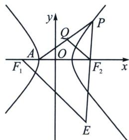

<!-- question-source:start -->
例15（2025临考猜题卷19题(25陪跑课学员刘自豪提问))已知双曲线 $C: \frac{x^2}{a^2} - \frac{y^2}{b^2} = 1 (a0, b > 0)$ 的左、右焦点分别为 $F_1, F_2$ ，左顶点为 $A$ ，且 $|F_1F_2| = 4, |AF_2| = 3|AF_1|$ .

(1)求双曲线 C 的方程;

## 高中数学 新思路 圆锥曲线专题

(2)过点 $F_{2}$ 作直线l，与C的右支交于M，N两点，求 $\triangle MNF_{1}$ 周长的最小值；

(3)已知点 $Q\left(\frac{1}{2}, \frac{3}{2} k\right)$ , 直线 $AQ$ 与 $C$ 的右支交于点 $P$ , 过点 $F_{1}$ 作 $F_{1}E // QF_{2}$ , 交直线 $PF_{2}$ 于点 $E$ , 证明: 点 $E$ 在定圆上。

(1) $x^{2} - \frac{y^{2}}{3} = 1$

(2)利用焦长公式(证明省略) $|MN|=\frac{2ab^{2}}{a^{2}-c^{2}\cos^{2}\alpha}=\frac{6}{1-2\cos^{2}\alpha}(1-2\cos^{2}\alpha>0)$ ，所以 $|MN|_{\min}=6$ ，故 $C_{\triangle MNF_{1}}=|MN|+4a\geqslant10;$

(3)又是离心率为2的隐藏二倍角模型, 如图, 先证明 $\angle PF_{2}A = 2\angle PAF_{2}$ , 设 $P(x_{0}, y_{0})$ , 因为 $\tan$ $\angle PF_{2}A = -\frac{y_{0}}{x_{0} - 2}$ , $\tan \angle PAF_{2} = \frac{y_{0}}{x_{0} + 1}$ , 所以 $\tan 2\angle PAF_{2} = \frac{2 \cdot \frac{y_{0}}{x_{0} + 1}}{1 - \left(\frac{y_{0}}{x_{0} + 1}\right)^{2}} = -\frac{y_{0}}{x_{0} - 2}$ , 所以 $\tan \angle PF_{2}A = \tan 2\angle PAF_{2}$ , $k_{AQ} = \frac{\frac{3}{2}k}{\frac{3}{2}} = k$ , $k_{QF_{2}} = \frac{\frac{3}{2}k}{-\frac{3}{2}} = -k$ , 所以 $\angle AF_{2}Q = \angle F_{2}AQ = \angle QF_{2}P$ , 所以 $\angle AF_{2}P = 2\angle F_{2}F_{1}E$ , 即 $\angle F_{2}F_{1}E = \angle F_{1}EF_{2}$ , 所以 $|F_{1}F_{2}| = |EF_{2}| = 4$ , 所以 $E$ 在以 $F_{2}$ 为圆心, 4为半径的圆上.
<!-- question-source:end -->

![[高中/总复习/专题/2026版高中《mst老唐说题》圆锥曲线专题（数学）/上册/第01章_圆锥曲线四定义/第二节_椭圆双曲的比值模型_第二定义/四_双曲线倍角定理/例题/answers/Q00048344A1.md]]
