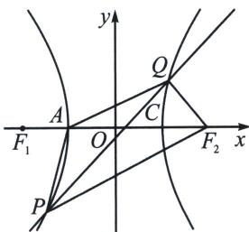

> [!faq]- 《圆锥曲线专题(上册)》例题解析
>
> > [!success]- **【答案】** BCD
>
> > [!note]- **【解析】**
> > 解析 对于选项 A: 利用点差法可知 $k_{PQ} \cdot k_{CC} = \frac{b^2}{a^2} = 3$ ，由于 $k_{CC} = \frac{\sqrt{3}}{2}$ ，所以 $k_{PQ} = 2\sqrt{3}$ ，故 A 错误；对于选项 B: 设 $Q(x_0, y_0)$ ，因为 $\tan \angle QF_2A = -\frac{y_0}{x_0 - 2}$ ， $\tan \angle QAF_2 = \frac{y_0}{x_0 + 1}$ ，所以 $\tan 2\angle QAF_2 = \frac{2 \cdot \frac{y_0}{x_0 + 1}}{1 - \left(\frac{y_0}{x_0 + 1}\right)^2} = -\frac{y_0}{x_0 - 2}$ ，所以 $\tan \angle QF_2A = \tan 2\angle QAF_2$ ，又因为 $\angle QF_2A$ ， $\angle QAF_2 \in (0, \pi)$ ，所以 $\angle QF_2A = 2\angle QAF_2$ ，故 B 正确；
> >
> > 对于选项 C: $\left|PF_{1}\right|\left|PF_{2}\right|=b^{2}-a^{2}+\left|PO\right|^{2}=2+\left|PO\right|^{2}$ ，所以 $\left|PO\right|^{2}<\left|PF_{1}\right|\cdot\left|PF_{2}\right|$ ，故 C 正确；
> >
> > 
> >
> > 对于选项D：因为 $|PF_{2}| - |PF_{1}| = 2a$ ， $|QF_{1}| - |QF_{2}| = 2a$ ，所以 $|PF_{1}| = |PF_{2}| - 2a$ ， $|QF_{1}| = 2a + |QF_{2}|$ ，所以 $|PF_{1}| + |QF_{1}| = |PF_{2}| - 2a + 2a + |QF_{2}| = |PF_{2}| + |QF_{2}|$ ，因为直线 $l$ 的斜率为 $\frac{2\sqrt{3}}{3}$ 即$k_{PQ}=\frac{2\sqrt{3}}{3}$ ，且过点 $C\left(1,\frac{\sqrt{3}}{2}\right)$ ，所以直线l的方程为： $2x-\sqrt{3}y-\frac{1}{2}=0$ ，又因为 $B(0,\sqrt{3})$ ， $F_{2}(2,0)$ ，所以 $k_{BF_{2}}=-\frac{\sqrt{3}}{2}$ 所以 $k_{PQ}\cdot k_{BF_{2}}=\frac{2\sqrt{3}}{3}\times\left(-\frac{\sqrt{3}}{2}\right)=-1$ ，即 $BF_{2}\perp PQ$ ，且 $BF_{2}$ 中点 $\left(\frac{0+2}{2},\frac{\sqrt{3}+0}{2}\right)$ ，恰好是C点，所以点B与点 $F_{2}$ 关于直线l对称，所以 $|PB|+|QB|=|PF_{2}|+|QF_{2}|$ ，所以 $|PF_{1}|+|QF_{1}|=|PB|+|QB|$ ，故D正确；故选BCD.
> >
> > 注意 关于 B 选项，是一个隐藏的二级结论，除了本题给到的解析方法，还可以涉及倍角三角形证明，利用椭圆第二定义，只需证明 $\left|QA\right|^{2}=\left|QF_{2}\right|\cdot\left(\left|QF_{2}\right|+\left|AF_{2}\right|\right)$ 即可，证明比本题解析相对复杂，一般不采用.
