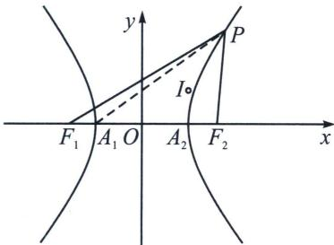
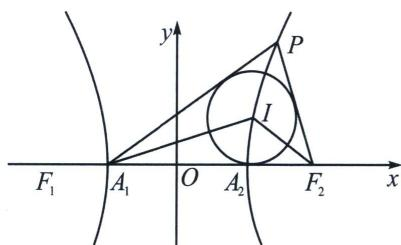

> [!faq]- 《圆锥曲线专题(上册)》例题解析
>
> > [!success]- **【答案】** ACD
>
> > [!note]- **【解析】**
> > 解析 对于 A, $\left|PF_{1}\right|^{2}-\left|PF_{2}\right|^{2}=(PF_{1}+PF_{2})(PF_{1}-PF_{2})=2(PF_{1}+PF_{2})\geqslant2F_{1}F_{2}=8$ , A 正确;
> >
> > 
> >
> > 
> >
> > 对于 B，若 P 为双曲线的右顶点 $A_{2}$ ，则 $\left|PQ\right|=A_{1}A_{2}=2<6$ ，B 错；
> >
> > 对于C， $|PF_1||PF_2| = b^2 -a^2 +|OP|^2\Rightarrow |PF_1||PF_2| - |OP|^2 = b^2 -a^2 = 2$ 为定值，C正确；
> >
> > 对于D，设 $I(x,y)$ ， $A_{1}(-1,0)$ ， $F_{2}(2,0)$ ，设 $P(x_0,y_0)$ ，因为 $\tan \angle PF_2A_1 = -\frac{y_0}{x_0 - 2},$
> >
> > $\tan \angle PA_{1}F_{2} = \frac{y_{0}}{x_{0} + 1}$ ，所以 $\tan 2\angle PA_1F_2 = \frac{2\cdot\frac{y_0}{x_0 + 1}}{1 - \left(\frac{y_0}{x_0 + 1}\right)^2} = -\frac{y_0}{x_0 - 2}$ ，所以 $\tan \angle PF_2A_1 = \tan 2\angle PA_1F_2$ $\angle PF_2A_1 = 2\angle PA_1F_2$ ，由于 $I$ 为 $\triangle PA_{1}F_{2}$ 的内心，故 $\angle IF_{2}A_{1} = 2\angle IA_{1}F_{2}$ ，设 $I(x_{1},y_{1})$ ，则 $-\frac{y_1}{x_1 - 2} = \frac{2\frac{y_1}{x_1 + 1}}{1 - \left(\frac{y_1}{x_1 + 1}\right)^2}$ ，则 $P(x_0,y_0)$ 与 $I(x_{1},y_{1})$ 均在同构方程 $-\frac{y}{x - 2} = \frac{2\frac{y}{x + 1}}{1 - \left(\frac{y}{x + 1}\right)^2}$ 上，即满足 $x^{2} - \frac{y^{2}}{3} = 1$ ，即在双曲线 $x^{2} - \frac{y^{2}}{3} = 1$ 上， $|IF_1| - |IF_2| = 2$ 为定值，D正确．
> >
> > 故选 **ACD**.
