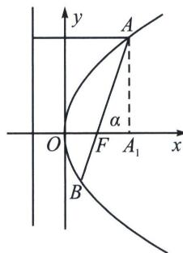

## 一、焦点弦与焦半径公式

1. 顶点为原点 $O(0, 0)$ , 以 $x$ 轴为对称轴, 且没有对称中心, 焦点为 $F\left(\frac{p}{2}, 0\right)$ , 准线为 $x = -\frac{p}{2}$ , 由于抛物线的离心率 $e$ 都等于 1 , 故抛物线通径为 $2ep = 2p$ ;

2. 焦半径： $|PF|=x_{0}+\frac{p}{2}.$

3. 焦点弦: $x_{A} + x_{B} + p = \frac{p}{1 - \cos \alpha} + \frac{p}{1 + \cos \alpha} = \frac{2 p}{\sin^ {2} \alpha} (\alpha \neq 0)$ ; 特殊地, 当 $\alpha = \frac{\pi}{2}$ 时, 为通径 $2 p$ .

证明：如图，作 $AA_{1} \perp x$ 轴于 $A_{1}$ ， $|AF| = x_{A} + \frac{p}{2}$ ， $\cos \alpha = \frac{|FA_{1}|}{|AF|}$ 所以 $\cos \alpha = \frac{x_{A} - \frac{p}{2}}{x_{A} + \frac{p}{2}} = 1 - \frac{p}{x_{A} + \frac{p}{2}} = 1 - \frac{p}{|AF|}$ 所以 $|AF| = \frac{p}{1 - \cos \alpha}$ ，同理 $|BF| = \frac{p}{1 + \cos \alpha}$ . $|AB| = |AF| + |BF| = \frac{p}{1 - \cos \alpha} + \frac{p}{1 + \cos \alpha} = \frac{2p}{\sin^{2}\alpha}$ .（利用极坐标可以秒证，由于新课标没有引入极坐标，故我们采用保守证明）

抛物线的性质和椭圆、双曲线比较起来，差别较大。它的离心率等于1；它只有一个焦点、一个顶点、

## 高中数学 新思路 圆锥曲线专题

一条对称轴、一条准线；它无中心，也没有渐近线。椭圆、双曲线都有中心，它们均可称为有心圆锥曲线；抛物线没有中心，称为无心圆锥曲线。

![[高中/总复习/专题/2026版高中《mst老唐说题》圆锥曲线专题（数学）/上册/第01章_圆锥曲线四定义/第五节_抛物线的焦准翻译/一_焦点弦与焦半径公式/例题/Q00048362.md]]
![[高中/总复习/专题/2026版高中《mst老唐说题》圆锥曲线专题（数学）/上册/第01章_圆锥曲线四定义/第五节_抛物线的焦准翻译/一_焦点弦与焦半径公式/例题/Q00048363.md]]
![[高中/总复习/专题/2026版高中《mst老唐说题》圆锥曲线专题（数学）/上册/第01章_圆锥曲线四定义/第五节_抛物线的焦准翻译/一_焦点弦与焦半径公式/例题/Q00048364.md]]
![[高中/总复习/专题/2026版高中《mst老唐说题》圆锥曲线专题（数学）/上册/第01章_圆锥曲线四定义/第五节_抛物线的焦准翻译/一_焦点弦与焦半径公式/例题/Q00048365.md]]
![[高中/总复习/专题/2026版高中《mst老唐说题》圆锥曲线专题（数学）/上册/第01章_圆锥曲线四定义/第五节_抛物线的焦准翻译/一_焦点弦与焦半径公式/例题/Q00048366.md]]
![[高中/总复习/专题/2026版高中《mst老唐说题》圆锥曲线专题（数学）/上册/第01章_圆锥曲线四定义/第五节_抛物线的焦准翻译/一_焦点弦与焦半径公式/例题/Q00048367.md]]
![[高中/总复习/专题/2026版高中《mst老唐说题》圆锥曲线专题（数学）/上册/第01章_圆锥曲线四定义/第五节_抛物线的焦准翻译/一_焦点弦与焦半径公式/例题/Q00048368.md]]
![[高中/总复习/专题/2026版高中《mst老唐说题》圆锥曲线专题（数学）/上册/第01章_圆锥曲线四定义/第五节_抛物线的焦准翻译/一_焦点弦与焦半径公式/例题/Q00048369.md]]
![[高中/总复习/专题/2026版高中《mst老唐说题》圆锥曲线专题（数学）/上册/第01章_圆锥曲线四定义/第五节_抛物线的焦准翻译/一_焦点弦与焦半径公式/例题/Q00048370.md]]
