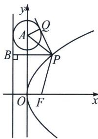

<!-- question-source:start -->
例9 (2024·多选·新课标Ⅱ卷)抛物线 C: $y^{2}=4x$ 的准线为 l, P 为 C 上的动点，过 P 作 $\odot A: x^{2}+(y-4)^{2}=1$ 的一条切线，Q 为切点，过 P 作 l 的垂线，垂足为 B，则
A. l 与 $\odot A$ 相切
B. 当 P, A, B 三点共线时， $|PQ|=\sqrt{15}$ C. 当 $|PB|=2$ 时， $PA\perp AB$ D. 满足 $|PA|=|PB|$ 的点 P 有且仅有 2 个

●解析 A 选项，抛物线 $y^{2}=4x$ 的准线为 x=-1，⊙A 的圆心 (0, 4) 到直线 x=-1 的距离显然是 1，等于圆的半径，故准线 l 和⊙A 相切，A 选项正确；

B 选项，P，A，B 三点共线时，即 $PA \perp l$ ，则 P 的纵坐标 $y_{P}=4$ ，由 $y_{P}^{2}=4x_{P}$ ，得到 $x_{P}=4$ ，故 $P(4,4)$ ，此时切线长 $|PQ|=\sqrt{|PA|^{2}-r^{2}}=\sqrt{4^{2}-1^{2}}=\sqrt{15}$ ，B 选项正确；

C 选项，当 $\left|PB\right|=2$ 时， $x_{P}=1$ ，此时 $y_{P}^{2}=4x_{P}=4$ ，故 $P(1,2)$ 或 $P(1,-2)$ ，当 $P(1,2)$ 时， $A(0,4)$ ， $B(-1,2)$ ， $k_{PA}=\frac{4-2}{0-1}=-2$ ， $k_{AB}=\frac{4-2}{0-(-1)}=2$ ，不满足 $k_{PA}k_{AB}=-1$ ；当 $P(1,-2)$ 时， $A(0,4)$ ， $B(-1,2)$ ， $k_{PA}=\frac{4-(-2)}{0-1}=-6$ ， $k_{AB}=\frac{4-(-2)}{0-(-1)}=6$ ，不满足 $k_{PA}k_{AB}=-1$ ；于是 $PA\perp AB$ 不成立，C 选项错误；

D选项，方法一：利用抛物线定义转化，根据抛物线的定义， $|PB|=|PF|$ ，这里 $F(1,0)$ ，

于是 $|PA|=|PB|$ 时P点的存在性问题转化成 $|PA|=|PF|$ 时P点的存在性问题，A(0,4)，F(1,0)，AF中点 $\left(\frac{1}{2},2\right)$ ，AF中垂线的斜率为 $-\frac{1}{k_{AF}}=\frac{1}{4}$ ，于是AF的中垂线方程为： $y=\frac{2x+15}{8}$ ，与抛物线 $y^{2}=4x$ 联立可得 $y^{2}-16y+30=0,\Delta=16^{2}-4\times30=136>0$ ，即AF的中垂线和抛物线有两个交点，

即存在两个 P 点，使得 $\left|PA\right|=\left|PF\right|$ ，D 选项正确.

方法二：（设点直接求解）设 $P\left(\frac{t^2}{4}, t\right)$ ，由 $PB \perp l$ 可得 $B(-1, t)$ ，又 $A(0, 4)$ ，又 $|PA| = |PB|$ ，

根据两点间的距离公式， $\sqrt{\frac{t^4}{16} + (t - 4)^2} = \frac{t^2}{4} + 1$ ，整理得 $t^2 - 16t + 30 = 0$ ， $\Delta = 16^2 - 4 \times 30 = 136 > 0$ ，则关于 $t$ 的方程有两个解，即存在两个这样的 $P$ 点，D选项正确。故选ABD.
<!-- question-source:end -->
