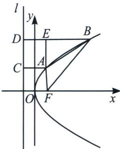

> [!faq]- 《圆锥曲线专题(上册)》例题解析
>
> > [!success]- **【答案】** $\frac{\sqrt{5}}{2}$
>
> > [!note]- **【解析】**
> > 解析 如图所示, 设抛物线的准线为 $l$ , 作 $AC \perp l$ 于点 $C$ , $BD \perp l$ 于点 $D$ , $AE \perp BD$ 于点 $E$ ,
> >
> > 
> >
> > 由抛物线的定义，可得 $AC = AF = 2$ ， $BD = BF = 4$ ，所以 $BE = 4 - 2 = 2$ ， $AE = \sqrt{AB^2 - BE^2} = \sqrt{9 - 4} = \sqrt{5}$ ，所以直线 $AB$ 的斜率 $k_{AB} = \tan \angle ABE = \frac{AE}{BE} = \frac{\sqrt{5}}{2}$ 故答案为 $\frac{\sqrt{5}}{2}$
