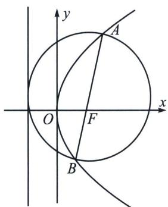
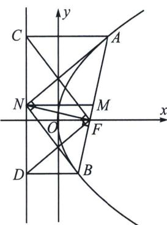

> [!faq]- 《圆锥曲线专题(上册)》例题解析
>
> > [!success]- **【答案】** $\frac{16}{3}$
>
> > [!note]- **【解析】**
> > 解析 解法一：由题意可得抛物线焦点 $F(1,0)$ ，直线 $l$ 的方程为 $y=\sqrt{3}(x-1)$ ，
> >
> > 代入 $y^{2} = 4x$ 并化简得 $3x^{2} - 10x + 3 = 0$ ，设 $A(x_{1},y_{1})$ ， $B(x_{2},y_{2})$ ，则 $x_{1} + x_{2} = \frac{10}{3}$ ； $x_{1}x_{2} = 1$
> >
> > 所以由抛物线的定义可得 $|AB|=x_{1}+x_{2}+p=\frac{10}{3}+2=\frac{16}{3}$ .
> >
> > 解法二： $|AB|=\frac{2p}{\sin^{2}60^{\circ}}=\frac{16}{3}$ . 故答案为 $\frac{16}{3}$ .
> >
> > 如图，抛物线 $E: y^{2} = 2px$ 的焦点为 $F$ ，过 $F$ 的直线与 $E$ 交于 $A$ 、 $B$ ，过 $A$ 、 $B$ 分别向准线 $l$ 作垂线，垂足为 $C$ 、 $D$ .
> > - **①**：以 AB 为直径的圆与准线 l 相切；
> >
> > 
> >
> > 
> > - **②**：记 AB 中点为 M，过 M 作 MN 垂直准线 l 于 N，则 $MN = \frac{1}{2} AB$ ，AN、BN 分别平分 $\angle CAB$ 、 $\angle DBA$ ， $FN \perp AB$ ， $\angle CFD = 90^{\circ}$ ;
> >
> > 证明: ①由于 $|AB| = x_{A} + x_{B} + p = |AC| + |BD| = 2|MN|$ , 所以 $AN \perp BN$ , 以 $M$ 为圆心, $MN$ 为半径的圆与准线 $CD$ 相切;
> >
> > $AC / / MN \Rightarrow \angle CAN = \angle ANM$ ② $AM = MN \Rightarrow \angle ANM = \angle MAN$ $\Rightarrow \angle CAN = \angle MAN$ ，易证 $\triangle ACN \cong \triangle AFN(SAS)$ ，所以 $CN = NF = ND$ ， $FN \perp AB$ ，所以 $\angle CFD = 90^{\circ}$
