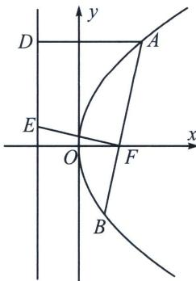

> [!faq]- 《圆锥曲线专题(上册)》例题解析
>
> > [!success]- **【答案】** ACD
>
> > [!note]- **【分析】**
> > 本题未单列分析。
>
> > [!note]- **【解析】**
> > 解析 由题可得, 抛物线 $C: y^{2} = 6x$ 的焦点 $F$ 为 $\left(\frac{3}{2}, 0\right)$ , 准线为 $x = -\frac{3}{2}$ , 由抛物线上一点到焦点的距离等于到准线的距离, 所以可知 $|AD| = |AF|$ , 故 A 选项正确.
> > 当 AB 为抛物线的通径时，AB=6，此时的 $AE=\sqrt{9+9}=3\sqrt{2}$ ， $6\neq3\sqrt{2}$ ，故 B 选项错误。由于 AB 为交点弦，最小时即 AB 为通径时的长度，所以 $|AB|\geqslant6$ ，故 C 选项正确。
> > 
> > 关于选项 D,
> > 解法一：设 $AB: x = my + \frac{3}{2}$ ，当 $m = 0$ 时， $AF = BF = 3$ ， $EF = 3$ ，此时 $AE = BE = 3\sqrt{2}$ ，则 $AE \cdot BE = 18$ ；当 $m \neq 0$ 时， $EF: x = \frac{-1}{m}y + \frac{3}{2}$ ，则 $E\left(-\frac{3}{2}, 3m\right)$ ，则 $EF = \sqrt{9 + 9m^2}$ ， $S_{\triangle AEB} = \frac{1}{2}AE \cdot BE\sin \angle AEB = \frac{1}{2}AB \cdot EF = \frac{1}{2}(6m^2 + 6)\sqrt{9 + 9m^2} = 9(m^2 +)^\frac{3}{2} > 9$ ，故 $S_{\triangle AEB} = AE \cdot BE > \frac{18}{\sin \angle AEB} \geqslant 18$ ，故 D 正确，
> > 解法二：利用抛物线性质，可得 $AE \perp EB$ ，所以 $AE \cdot BE = AB \cdot EF = \frac{2p}{\sin^{2}\theta} \times \frac{p}{\sin\theta} \geqslant 2p^{2} = 18$ ，故 D 正确，选 ACD.
