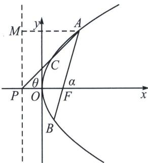

## 二、焦准斜率关系与转化

如图所示，以抛物线 $y^{2}=2px$ (p>0) 为例，AB 是焦点弦，AC 过准线与 x 轴交点 $P\left(-\frac{p}{2},0\right)$ ，设 $\angle AFx=\alpha$ ， $\angle APF=\theta$ ，则一定有：① $y_{B}+y_{C}=0$ ；② $\sin\alpha=\tan\theta$ ，③ $\frac{1}{\tan^{2}\theta}-\frac{1}{\tan^{2}\alpha}=1$ ；

$$
\left\{ \begin{array}{l} y ^ {2} = 2 p x \\ x = t _ {1} y + \frac {p}{2} \end{array} \Rightarrow y ^ {2} - 2 p t _ {1} y - p ^ {2} = 0 \Rightarrow y _ {A} y _ {B} = - p ^ {2}, \left\{ \begin{array}{l} y ^ {2} = 2 p x \\ x = t _ {2} y - \frac {p}{2} \end{array} \Rightarrow y ^ {2} - 2 p t _ {2} y + p ^ {2} = 0 \Rightarrow y _ {A} y _ {C} = p ^ {2}, \right. \right.
$$

所以 $\frac{y_A y_B}{y_A y_C} = -1$ ，即 $y_B + y_C = 0$ ； $\sin \alpha = \frac{|y_A|}{|AF|} = \frac{|MP|}{|AM|} = \tan \theta$ ， $\frac{1}{\tan^2\theta} - \frac{1}{\tan^2\alpha} = \frac{1}{\sin^2\alpha} - \frac{1 - \sin^2\alpha}{\sin^2\alpha} = 1$ ；

![[高中/总复习/专题/2026版高中《mst老唐说题》圆锥曲线专题（数学）/上册/第01章_圆锥曲线四定义/第五节_抛物线的焦准翻译/二_焦准斜率关系与转化/例题/Q00048950.md]]
![[高中/总复习/专题/2026版高中《mst老唐说题》圆锥曲线专题（数学）/上册/第01章_圆锥曲线四定义/第五节_抛物线的焦准翻译/二_焦准斜率关系与转化/例题/Q00048951.md]]
![[高中/总复习/专题/2026版高中《mst老唐说题》圆锥曲线专题（数学）/上册/第01章_圆锥曲线四定义/第五节_抛物线的焦准翻译/二_焦准斜率关系与转化/例题/Q00048372.md]]
