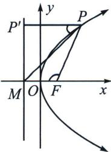

<!-- question-source:start -->
例10 (2024·茂名模拟)已知抛物线 $C: y^{2} = 2px (p > 0)$ 的焦点为 $F, C$ 的准线与 $x$ 轴的交点为 $M$ , 点 $P$ 是 $C$ 上一点, 且点 $P$ 在第一象限, 设 $\angle PMF = \alpha, \angle PFM = \beta$ , 则 ( )

高中数学 新思路 圆锥曲线专题
A. $\tan\alpha=\sin\beta$ B. $\tan\alpha=-\cos\beta$ C. $\tan\beta=-\sin\alpha$ D. $\tan\beta=-\cos\alpha$

<!-- question-source:end -->

![[高中/总复习/专题/2026版高中《mst老唐说题》圆锥曲线专题（数学）/上册/第01章_圆锥曲线四定义/第五节_抛物线的焦准翻译/二_焦准斜率关系与转化/例题/answers/Q00048950A1.md]]
