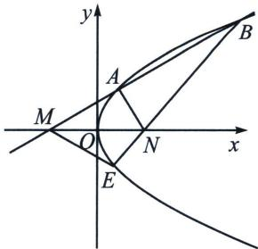

<!-- question-source:start -->
例①（2024·绵阳模拟）如图，过点 $M(-1,0)$ 的直线交抛物线 $C: y^{2} = 2x$ 于 $A, B$ 两点，点 $A$ 在 $M, B$ 之间，点 $N$ 与点 $M$ 关于原点对称，延长 $BN$ 交抛物线 $C$ 于 $E$ ，记直线 $AN$ 的斜率为 $k_{1}$ ，直线 $ME$ 的斜率为 $k_{2}$ ，当 $k_{1} = 3k_{2}$ 时，直线 $AB$ 的斜率为 （）

A. $\frac{2}{3}$ B. 1 C. $\sqrt{2}$ D. $\sqrt{3}$
<!-- question-source:end -->

![[高中/总复习/专题/2026版高中《mst老唐说题》圆锥曲线专题（数学）/上册/第01章_圆锥曲线四定义/第五节_抛物线的焦准翻译/二_焦准斜率关系与转化/例题/answers/Q00048951A1.md]]
