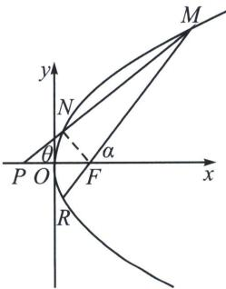

> [!faq]- 《圆锥曲线专题(上册)》例题解析
>
> > [!success]- **【答案】** ACD
>
> > [!note]- **【解析】**
> > 解析 对于选项 A: 因为点 $P(-1, 0)$ 为抛物线 $C: y^{2} = 2px (p > 0)$ 的准线与 $x$ 轴的交点, 所以 $p = 2$ , 则抛物线 $C$ 的方程为 $y^{2} = 4x$ , 焦点 $F(1, 0)$ , 准线方程为 $x = -1$ ,
> >
> > 不妨设线段 $MN$ 的中点为 $H$ , 分别过点 $M, N, H$ 作准线的垂线, 垂足分别为 $Q, T, S$ , 由梯形中位线性质和抛物线定义可得 $|HS| = \frac{1}{2} (|MQ| + |NT|) = \frac{1}{2} (|MF| + |NF|) \geqslant \frac{1}{2} |MN| = 5$ , 当且仅当 $M, N, F$ 三点共线时, 等号成立, 则 $MN$ 中点横坐标的最小值为 4 , 故选项 A 正确;
> >
> > 
> >
> > 对于选项 B：如图， $MF \perp NF$ ，易知 $y_{N} + y_{R} = 0$ ，则 $k_{MF} = -k_{NF} = 1$ ， $\frac{1}{\tan^{2}\theta} - \frac{1}{\tan^{2}\alpha} = \frac{1}{k_{MN}^{2}} - 1 = 1$ ，
> >
> > 所以直线 $MN$ 的斜率为 $\frac{\sqrt{2}}{2}$ ，故选项B错误；
> >
> > 对于选项 C: $\overrightarrow{MN}=4\overrightarrow{FN}$ ，则 $\frac{p}{1-\cos\alpha}=\frac{3p}{1+\cos\alpha}$ ，故 $\cos\alpha=\frac{1}{2}$ ，故选项 C 正确；
> >
> > 对于选项D：不妨设 $D(x_{3},y_{3})$ ，因为 $O,M,D,N$ 四点共圆，不妨设该圆的方程为 $x^{2} + y^{2} + dx + ey$ $= 0$ ，联立 $\left\{ \begin{array}{l}x^{2} + y^{2} + dx + ey = 0\\ y^{2} = 4x \end{array} \right.$ ，消去 $x$ 并整理得 $y[y^3 +(4d + 16)y + 16e] = 0$ ，所以 $y_{1},y_{2},y_{3}$ 为关于 $y$ 的方程 $y^{3} + (4d + 16)y + 16e = 0$ 的3个根，则 $y^{3} + (4d + 16)y + 16e = (y - y_{1})(y - y_{2})(y - y_{3})$ ，因为 $(y - y_{1})(y-$ $y_{2})(y - y_{3}) = y^{3} - (y_{1} + y_{2} + y_{3})y^{2} + (y_{1}y_{2} + y_{2}y_{3} + y_{1}y_{3})y - y_{1}y_{2}y_{3}$ ，所以 $y_{1} + y_{2} + y_{3} = 0$ ，则△DMN的重心的纵坐标为0，即重心在 $x$ 轴上，故选项D正确．
> >
> > 故选 **ACD**.
