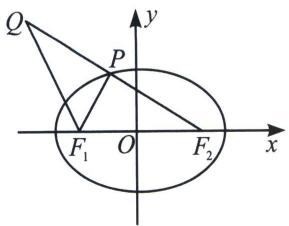
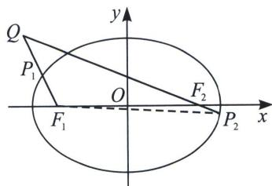
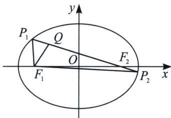

## 一、椭圆最值问题

1. 若 $Q$ 在椭圆外, 求 $|PQ| - |PF_1|$ 最小值, 则构造 $|PQ| + 2a - |PF_1| - 2a = |PQ| + |PF_2| - 2a$ , 利用三点共线求最值 (如左图所示), 当且仅当 $P$ 、 $Q$ 、 $F_2$ 三点共线时等号成立。此类型的题目叫做声东击西, 即问左焦点, 则连接右焦点, 问右焦点则连左焦点, 三点共线是关键。

## 高中数学 新思路 圆锥曲线专题

2. 若 $Q$ 为椭圆外一定点 (如右图所示), 则 $|QF_{1}| \leqslant |PQ| + |PF_{1}| \leqslant 2a + |QF_{2}|$ , 当且仅当 $P_{1} 、 F_{1} 、 Q$ 三点共线时, 左边等号成立, 当且仅当 $Q 、 F_{2} 、 P_{2}$ 三点共线时 ( $P_{2}$ 位于 $QF_{2}$ 延长线上), 等号成立.

3. 若 $Q$ 为椭圆内一定点 (如下图所示), 则 $2a - |QF_{2}| \leqslant |PQ| + |PF_{1}| \leqslant 2a + |QF_{2}|$ , 当且仅当 $P_{1} 、 Q 、 F_{2}$ 三点共线时, 左边等号成立, 当且仅当 $P_{2} 、 F_{2} 、 Q$ 三点共线时 ( $P_{2}$ 位于 $QF_{2}$ 延长线上), 右边等号成立,

