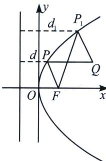
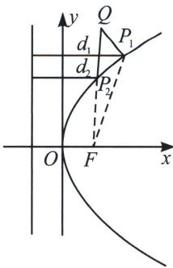

## 三、抛物线最值问题

根据两点之间线段最短定理，可以知道 P 为抛物线上一点：

(1)当 $Q(x_{Q}, y_{Q})$ 为抛物线内任意一点, 则存在 $|PF| + |PQ|$ 的最小值, 当 $P、Q$ 两点的纵坐标相等时, 即 $|PF| + |PQ|_{\min} = |EQ| = x_{Q} + \frac{p}{2}$ (参考下图, 内部连准线)

(2) 当 $Q(x_{Q}, y_{Q})$ 为抛物线外任意一点, 存在 $d + |PQ|$ 最小值, 当 $Q、P、F$ 三点共线时, $(d + |PQ|)_{\min} = |FQ| = \sqrt{\left(x_{Q} - \frac{p}{2}\right)^{2} + y_{Q}^{2}}$ (参考下图, 外部连焦点)

由此类比抛物线 $x^{2}=2py$ 的最值问题，把握内连准线，外找焦点.

![[高中/总复习/专题/2026版高中《mst老唐说题》圆锥曲线专题（数学）/上册/第01章_圆锥曲线四定义/第六节_长度最值问题之声东击西/三_抛物线最值问题/例题/Q00048376.md]]
![[高中/总复习/专题/2026版高中《mst老唐说题》圆锥曲线专题（数学）/上册/第01章_圆锥曲线四定义/第六节_长度最值问题之声东击西/三_抛物线最值问题/例题/Q00048377.md]]
![[高中/总复习/专题/2026版高中《mst老唐说题》圆锥曲线专题（数学）/上册/第01章_圆锥曲线四定义/第六节_长度最值问题之声东击西/三_抛物线最值问题/例题/Q00048378.md]]
