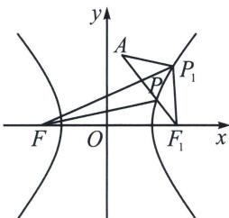

> [!faq]- 《圆锥曲线专题(上册)》例题解析
>
> > [!success]- **【答案】** C
>
> > [!note]- **【解析】**
> > 解析 如图所示
> >
> > 
> >
> > 由题意知 $\left\{\begin{aligned}\frac{b}{a}&=1\\2c&=8\\c^{2}&=a^{2}+b^{2}\end{aligned}\right.$ ，解得 $a=2\sqrt{2}$ ， $b=2\sqrt{2}$ ，c=4，记C的右焦点为 $F_{1}$ ，即 $F_{1}(4,0)$ ，
> >
> > 由双曲线的定义，得 $|PF| - |PF_1| = 2a = 4\sqrt{2}$ ，即 $|PF| = 4\sqrt{2} + |PF_1|$
> >
> > $$
> > \left| P F \right| + \left| P A \right| = 4 \sqrt {2} + \left| P A \right| + \left| P F _ {1} \right| \geqslant 4 \sqrt {2} + \left| A F _ {1} \right| = 4 \sqrt {2} + \sqrt {(1 - 4) ^ {2} + (3 - 0) ^ {2}} = 7 \sqrt {2},
> > $$
> >
> > 当且仅当点 $P$ 在线段 $AF_{1}$ 上时等号成立，所以 $|PF| + |PA|$ 的最小值为 $7\sqrt{2}$ 。
> >
> > 故选 **C**.
