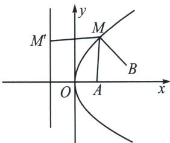

> [!faq]- 《圆锥曲线专题(上册)》例题解析
>
> > [!success]- **【答案】** BCD
>
> > [!note]- **【分析】**
> > 本题未单列分析。
>
> > [!note]- **【解析】**
> > 解析 对于 A，若 C 为抛物线 $y^{2}=8x$ ，则 $F(2,0)$ ，故 A 为焦点，过 M 作准线 x=-2 的垂线，垂足为 $M'$ ，$|MA|+|MB|=|MM'|+|MB|\geqslant4+2=6$ ，当且仅当M，B， $M'$ 在同一直线上时取等号，故A错误；
> > 对于 B，若 C 为椭圆 $\frac{x^{2}}{25}+\frac{y^{2}}{21}=1$ ，则 A 为椭圆的右焦点，设左焦点为 $F(-2,0)$ ，
> > 
> > $$
> > \left| M A \right| + \left| M B \right| = 2 a - \left| M F \right| + \left| M B \right| = 2 a - (\left| M F \right| - \left| M B \right|) \geqslant 2 a - \left| F B \right| = 1 0 - \sqrt {(4 + 2) ^ {2} + 1 ^ {2}} = 1 0
> > $$
> > $-\sqrt{37}$ ，当且仅当 M，F，B 共线且 B 在 F，M 之间时等号成立，故 B 正确；
> > 对于C，若 $C$ 为双曲线 $x^{2} - \frac{y^{2}}{3} = 1$ ，则 $A$ 为双曲线的右焦点，左焦点为 $F(-2,0)$
> > $$
> > \left| M A \right| + \left| M B \right| = \left| M F \right| - 2 a + \left| M B \right| = \left| M F \right| + \left| M B \right| - 2 \geqslant \left| F B \right| - 2 = \sqrt {(4 + 2) ^ {2} + 1 ^ {2}} - 2 = \sqrt {3 7} - 2,
> > $$
> > 当且仅当 M, F, B 共线时等号成立，故 C 正确；
> > 对于D，若 $C$ 为圆 $x^{2} + y^{2} = 1T\left(\frac{1}{2},0\right)$ 。易得圆 $C$ 是关于 $T$ ， $A$ 的阿氏圆。 $\frac{|MT|}{|MA|} = \frac{1}{2}$ ，所以 $\frac{1}{2}|MA| = |MT|$ ， $\frac{1}{2}|MA| + |MB| = |MT| + |MB| \geqslant |BT| = \sqrt{\left(4 - \frac{1}{2}\right)^2 + (1 - 0)^2} = \frac{\sqrt{53}}{2}$ ，当且仅当 $M$ ， $T$ ， $B$ 三点共线时等号成立，故D正确。
> >
> > 故选 **BCD**。
