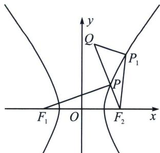

## 二、双曲线最值问题

求 $|PQ|+|PF_{1}|$ 最值，则构造 $|PQ|+2a+|PF_{1}|-2a=|PQ|+|PF_{2}|+2a$ ，当且仅当P、Q、 $F_{2}$ 三点共线时等号成立。（如下图所示）.

由于椭圆和双曲线的第二定义已经不在高考范围内，形如“ $|PM|+\frac{1}{e}|PF|$ ”的最值已经不是考试的常考范围，关于问焦点则连接准线的类型题目只适合抛物线，这里不做详述。其它双曲线最值类比椭圆，画图仔细分析即可。
