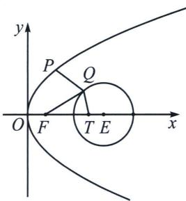

<!-- question-source:start -->
例6 (2024·成都三模)已知点 $P, Q$ 分别是抛物线 $C: y^{2} = 4x$ 和圆 $E: x^{2} + y^{2} - 10x + 21 = 0$ 上的动点, 若抛物线 $C$ 的焦点为 $F$ , 则 $2|PQ| + |QF|$ 的最小值为 ( )
A. 6 B. $2 + 2\sqrt{5}$ C. $4\sqrt{3}$ D. $4 + 2\sqrt{3}$

<!-- question-source:end -->

![[高中/总复习/专题/2026版高中《mst老唐说题》圆锥曲线专题（数学）/上册/第01章_圆锥曲线四定义/第六节_长度最值问题之声东击西/四_阿氏圆反演与圆锥曲线最值问题/例题/answers/Q00048381A1.md]]
