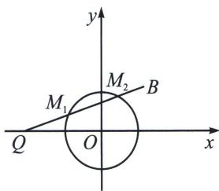

> [!faq]- 《圆锥曲线专题(上册)》例题解析
>
> > [!success]- **【答案】** C
>
> > [!note]- **【分析】**
> > 本题未单列分析。
>
> > [!note]- **【解析】**
> > 解析 令 $2|MP| = |MQ|$ , 则 $\frac{|MQ|}{|MP|} = 2$ , 由题意可得圆 $x^{2} + y^{2} = 1$ 是关于 $P, Q$ 的阿波罗尼斯圆, 且 $\lambda = 2$ ,
> > 
> > ## 高中数学 新思路 圆锥曲线专题
> > 我们根据阿氏圆两个最重要特征之一： $|OP| \cdot |OQ| = r^2 \Rightarrow |OQ| = 2$ ，所以 $2|MP| + |MB| = |MQ| + |MB|$ ，由图象可知，当点 M 位于 $M_1$ 或 $M_2$ 时取得最小值，且最小值为 $|QB| = \sqrt{(-2-1)^2 + 1} = \sqrt{10}$ 。
> >
> > 故选 **C**.
