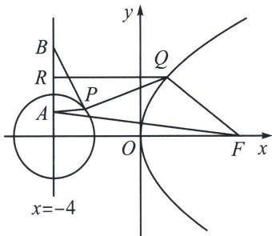

> [!faq]- 《圆锥曲线专题(上册)》例题解析
>
> > [!success]- **【答案】** ACD
>
> > [!note]- **【分析】**
> > 本题未单列分析。
>
> > [!note]- **【解析】**
> > 解析 因为点 $(2, -4\sqrt{2})$ 在抛物线 $C: y^{2} = 2px (p > 0)$ 上，可得 $32 = 4p$ ，解得 $p = 8$ ，所以 $y^{2} = 16x$ ，45 老唐说题
> > 对于A中，抛物线 $y^{2} = 16x$ 的焦点为 $F(4,0)$ ，准线方程为 $x = -4$ ，设抛物线上一点 $S(x_0, y_0)$ 到焦点 $F(4,0)$ 的距离为5，则 $|SF| = x_0 + \frac{p}{2} = x_0 + 4 = 5$ ，所以 $x_0 = 1$ ，所以A正确；
> > 对于B中，设 $M(x_{1},y_{1})$ ， $N(x_{2},y_{2})$ ，不妨设点 $M$ 在 $x$ 轴上方，由 $\overrightarrow{MH} = 2\overrightarrow{HN}$ ，可得 $y_{1} = -2y_{2}$ 由已知直线 $l$ 的斜率必不为0，故可设直线 $l:x = ty + 2$ ，联立方程 $\left\{ \begin{array}{l}y^{2} = 16x\\ x = ty + 2 \end{array} \right.$ ，整理得 $y^{2} - 16ty - 32 =$ 0，则满足 $\left\{ \begin{array}{l}\Delta = 256t^2 +128 > 0\\ y_1 + y_2 = 16t\\ y_1y_2 = -32\\ y_1 = -2y_2 \end{array} \right.$ ，解得 $\left\{ \begin{array}{l}y_{1} = 8\\ y_{2} = -4 \end{array} \right.$ ，所以 $M(4,8)$ ， $N(1, - 4)$ ，所以 $S_{\triangle OMN} = S_{\triangle OHM} + S_{\triangle OHN} =$ $\frac{1}{2}\times |OH|\times |y_1 - y_2| = \frac{1}{2}\times 2\times 12 = 12$ ，所以B错误；
> > 
> > 对于 C 中，设 $P(x, y)$ ，则 $\frac{|PA|}{|PB|} = \frac{\sqrt{(x+4)^{2} + (y-1)^{2}}}{\sqrt{(x+4)^{2} + (y-9)^{2}}} = \frac{1}{3}$ ，整理得 $(x+4)^{2} + y^{2} = 9$ ，所以点 P 的轨迹为以 $E(-4, 0)$ 为圆心，3 为半径的圆，又抛物线 C: $y^{2} = 16x$ 的焦点为 $F(4, 0)$ ，准线方程为 x = -4，
> > 则 $|PB| + 3|PQ| + 3|QR| = 3|PA| + 3|PQ| + 3|QF| = 3(|PA| + |PQ| + |QF|) \geqslant 3|AF| = 3\sqrt{65}$ ，当且仅当 $A, P, Q, F(P, Q$ 两点在 $A, F$ 两点中间)四点共线时取等号，所以 $|PB| + 3|PQ| + 3|QR|$ 的最小值为 $3\sqrt{65}$ ，所以 C 正确；
> > 对于D中，设点 $T\left(\frac{y_P^2}{16}, y_P\right)$ ，由曲线 $E$ 是圆心为 $E(-4, 0)$ ，半径为3的圆，切线长为 $\sqrt{119}$ ，
> > 可得 $|TE| = 8\sqrt{2}$ ，即 $\left(\frac{y_T^2}{16} + 4\right)^2 + y_T^2 = 128$ ，解得 $y_T^2 = 64$ ，可得 $x_T = 4$ ，再由抛物线定义可得点 $T$ 到 $C$ 的准线的距离为 $4 + 4 = 8$ ，所以 D 正确。
> >
> > 故选 **ACD**.
