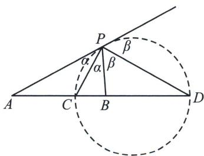

## 四、阿氏圆反演与圆锥曲线最值问题

一般地，平面内到两个定点距离之比为常数 $\lambda (\lambda > 0, \lambda \neq 1)$ 的点的轨迹是圆，此圆被叫做“阿波罗尼斯圆”。特殊地，当 $\lambda = 1$ 时，点 $P$ 的轨迹是线段 $AB$ 的中垂线。

求证：已知动点 P 与两定点 A、B 的距离之比为 $\lambda (\lambda > 0)$ ，那么点 P 的轨迹是什么？

证明：不妨设 $A(-c, 0)$ 、 $B(c, 0)(c > 0)$ ， $P(x, y)$ ，由 $\frac{|PA|}{|PB|} = \lambda (\lambda > 0)$ 得： $\frac{\sqrt{(x + c)^2 + y^2}}{\sqrt{(x - c)^2 + y^2}} = \lambda$ ，即

$$
(1 - \lambda^ {2}) x ^ {2} + 2 c (1 + \lambda^ {2}) x + c ^ {2} (1 - \lambda^ {2}) + (1 - \lambda^ {2}) y ^ {2} = 0,
$$

①当 $\lambda \neq 1$ 时，即为 $x^{2} + \frac{2c(1 + \lambda^{2})}{1 - \lambda^{2}} x + c^{2} + y^{2} = 0$ ，整理得： $\left(x - \frac{\lambda^2 + 1}{\lambda^2 - 1} c\right)^2 +y^2 = \left(\frac{2\lambda c}{\lambda^2 - 1}\right)^2$ ，即点 $P$ 的轨迹是以 $\left(\frac{\lambda^2 + 1}{\lambda^2 - 1} c,0\right)$ 为圆心， $\left|\frac{2\lambda c}{\lambda^2 - 1}\right|$ 为半径的圆；

②当 $\lambda=1$ 时，化简得 x=0，即点 P 的轨迹为 y 轴.

如图, 易知① $PC$ 为 $\angle APB$ 的内角平分线, $PD$ 为 $\angle APB$ 的外角平分线; ② $P(AB, CD) = -1$ ; ③ $PC \perp PD$ ; 以上三个条件中, 知道任意两个都可以推得第三个!

设阿波罗尼斯圆的圆心为 O，半径 OC=OD=r，则有 $\frac{PA}{PB}=\frac{AC}{CB}=\frac{AD}{DB}=\lambda$ ，即 $\frac{OA-r}{r-OB}=\frac{OA+r}{OB+r}=\lambda$ ，即 $\frac{OA-r+OA+r}{r-OB+r+OB}=\frac{OA-r-(OA+r)}{r-OB-(r+OB)}=\lambda$ ，即 $\frac{OA}{r}=\frac{r}{OB}=\lambda$ ，即 $OA\cdot OB=r^{2}$ （反演）.
同时， $\frac{OA}{r}=\frac{r}{OB}=\lambda\Rightarrow\left\{\begin{aligned}\frac{OA}{r}&=\lambda\\ \frac{OB}{r}&=\frac{1}{\lambda}\end{aligned}\right.\Rightarrow\left|\frac{OA}{r}-\frac{OB}{r}\right|=\frac{AB}{r}=\left|\lambda-\frac{1}{\lambda}\right|$ ，即 $r=\frac{AB}{\left|\lambda-\frac{1}{\lambda}\right|}$ .
半径公式 已知动点 P 与两定点 A、B 的距离之比为 $\lambda (\lambda \neq 1)$ ，则已知两个定点 A、B，及定比 $\lambda$ ，则.
▶注意 阿氏圆的常用公式 $\frac{PA}{PB}=\frac{OA}{r}=\frac{r}{OB}=\lambda,\quad OA\cdot OB=r^{2}$ ，阿氏圆的半径为： $r=\left|\frac{AB}{\lambda-\frac{1}{\lambda}}\right|$

![[高中/总复习/专题/2026版高中《mst老唐说题》圆锥曲线专题（数学）/上册/第01章_圆锥曲线四定义/第六节_长度最值问题之声东击西/四_阿氏圆反演与圆锥曲线最值问题/例题/Q00048379.md]]
![[高中/总复习/专题/2026版高中《mst老唐说题》圆锥曲线专题（数学）/上册/第01章_圆锥曲线四定义/第六节_长度最值问题之声东击西/四_阿氏圆反演与圆锥曲线最值问题/例题/Q00048380.md]]
![[高中/总复习/专题/2026版高中《mst老唐说题》圆锥曲线专题（数学）/上册/第01章_圆锥曲线四定义/第六节_长度最值问题之声东击西/四_阿氏圆反演与圆锥曲线最值问题/例题/Q00048381.md]]
![[高中/总复习/专题/2026版高中《mst老唐说题》圆锥曲线专题（数学）/上册/第01章_圆锥曲线四定义/第六节_长度最值问题之声东击西/四_阿氏圆反演与圆锥曲线最值问题/例题/Q00048382.md]]
