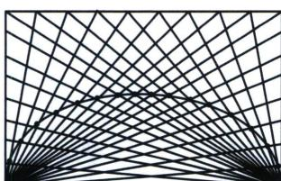
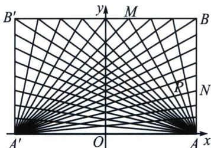

<!-- question-source:start -->
例2（苏教版选修第一册 P87）把矩形的各边 n 等分，如图连接直线，判断对应直线的交点是否在一个椭圆上，为什么？

<!-- question-source:end -->

![[高中/总复习/专题/2026版高中《mst老唐说题》圆锥曲线专题（数学）/上册/第01章_圆锥曲线四定义/第四节_圆锥曲线的第四定义/例题/answers/Q00048355A1.md]]
