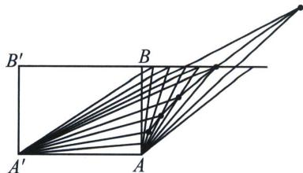
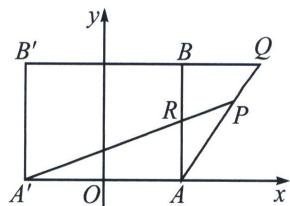

<!-- question-source:start -->
例3（苏教版选修第一册 P100）如图，在矩形 $ABB'A'$ 中，把边 AB 分成 n 等份。在边 $B'B$ 的延长线上， $BB'$ 的 n 分之一为单位长度连续取点。过边 AB 上各分点和 $A'$ 作直线，过 $B'B$ 延长线上的对应分点和点 A 作直线，这两条直线的交点为 P，P 在什么曲线上运动？

<!-- question-source:end -->

![[高中/总复习/专题/2026版高中《mst老唐说题》圆锥曲线专题（数学）/上册/第01章_圆锥曲线四定义/第四节_圆锥曲线的第四定义/例题/answers/Q00048356A1.md]]
