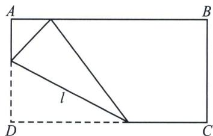

<!-- question-source:start -->
例4 (苏教版选修第一册 P105)如图, 将一张长方形纸片 $ABCD$ 的一只角斜折, 使点 $D$ 总是落在对边 $AB$ 上, 然后展开纸片, 得到一条折痕 $l$ . 这样继续下去, 得到若干折痕, 观察这些折痕围成的轮廓, 它是什么曲线?

<!-- question-source:end -->

![[高中/总复习/专题/2026版高中《mst老唐说题》圆锥曲线专题（数学）/上册/第01章_圆锥曲线四定义/第四节_圆锥曲线的第四定义/例题/answers/Q00048357A1.md]]
