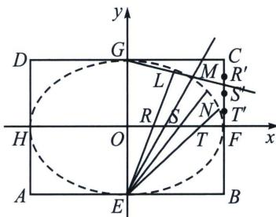

<!-- question-source:start -->
例①（人教 A 版选择性必修一 P116）如图，矩形 ABCD 中， $|AB|=2a,\quad|BC|=2b(a>b>0)$ . E, F, G, H 分别是矩形四条边的中点，R, S, T 是线段 OF 的四等分点， $R'$ , $S'$ , $T'$ 是线段 CF 的四等分点. 证明直线 ER 与 $GR'$ 、ES 与 $GS'$ 、ET 与 $GT'$ 的交点 L, M, N 都在椭圆 $\frac{x^{2}}{a^{2}}+\frac{y^{2}}{b^{2}}=1(a>b>0)$ 上.

<!-- question-source:end -->

![[高中/总复习/专题/2026版高中《mst老唐说题》圆锥曲线专题（数学）/上册/第01章_圆锥曲线四定义/第四节_圆锥曲线的第四定义/例题/answers/Q00048949A1.md]]
