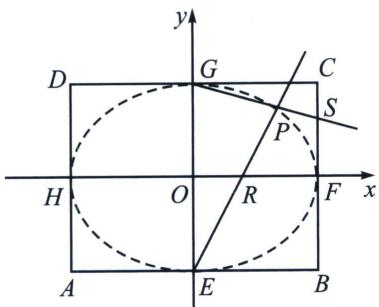
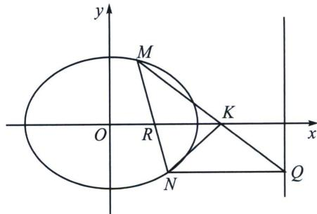

<!-- question-source:start -->
例5 (湖北省武汉市2025届高三五月调考)建立如图所示的坐标系. 矩形ABCD中, $|AB|=4$ , $|BC|=2\sqrt{3}$ . E, F, G, H分别是矩形四条边的中点, 直线HF, BC上的动点R, S满足 $\overrightarrow{OR}=\lambda\overrightarrow{OF}$ , $\overrightarrow{CS}=\lambda\overrightarrow{CF} (\lambda\in\mathbb{R})$ , 直线ER与GS的交点为P.

(1)证明点 P 在一个确定的椭圆上，并求此椭圆的方程；

(2)当 $\lambda=\frac{1}{2}$ 时，过点 R 的直线 l（与 x 轴不重合）与 (1) 中的椭圆交于 M，N 两点，过点 N 作直线 x=4 的垂线，垂足为点 Q。设直线 MQ 与 x 轴交于点 K，求 $\triangle KMR$ 面积的最大值。

<!-- question-source:end -->

![[高中/总复习/专题/2026版高中《mst老唐说题》圆锥曲线专题（数学）/上册/第01章_圆锥曲线四定义/第四节_圆锥曲线的第四定义/例题/answers/Q00052973A1.md]]
