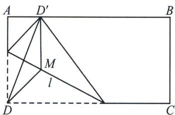

> [!faq]- 《圆锥曲线专题(上册)》例题解析
>
> > [!success]- **【答案】** 详见解析
>
> > [!note]- **【分析】**
> > 本题未单列分析。
>
> > [!note]- **【解析】**
> > 解析 设点 $D$ 折后落到 $AB$ 边上的点 $D'$ , 则线段 $DD'$ 被折痕 $l$ 垂直平分, 在折痕 $l$ 上取一点 $M$ , 且 $MD' \perp AB$ , 则可得, $MD' = MD$ , 即折痕围成的轮廓上的任意一点到定直线 $AB$ 的距离与它到定点 $D$ 的距离相等, 所以根据抛物线的定义可知折痕围成的轮廓曲线是以 $D$ 为焦点, $AB$ 为准线的抛物线.
> > 
