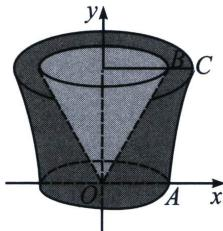

例16（2024·盐城期末）祖暅，祖冲之之子，他的“祖暅原理”：幂势既同，则积不容异．意思是：夹在两个平行平面之间的两个几何体，被平行于这两个平面的任意平面所截，如果截得的面积总相等，那么这两个几何体的体积相等．将双曲线 $E: \frac{x^2}{9} - \frac{y^2}{25} = 1$ 与 $y = 0$ ， $y = 5$ 所围成的平面图形（含边界）绕其虚轴旋转一周得到如图所示的几何体 $\Gamma$ ，其中线段 $OA$ 为双曲线的实半轴，直线 $y = 5$ 分别与双曲线 $E$ 的一条渐近线及右支交于点 $B$ 和 $C$ ，则线段 $BC$ 旋转一周所得图形的面积为 \_\_\_\_ ，几何体 $\Gamma$ 的体积为 \_\_\_\_.

解析 双曲线 $E: \frac{x^2}{9} - \frac{y^2}{25} = 1$ 的 $a = 3, b = 5$ , 可得渐近线方程为 $y = \pm \frac{5}{3} x$ , 由 $\left\{ \begin{array}{l} y=5 \\ y=\frac{5}{3}x \end{array} \right.$ , 可得 $B(3, 5)$ , 由 $\left\{ \begin{array}{l} y=5 \\ \frac{x^2}{9} - \frac{y^2}{25} = 1 \end{array} \right.$ , 解得 $C(3\sqrt{2}, 5)$ , 则线段 $BC$ 旋转一周所得图形的面积为 $S_1 = \pi (3\sqrt{2})^2 - 9\pi = 9\pi$ ; 因为被平行于这两个平面的任意平面所截, 两个截面的面积总相等, 又双曲线的实半轴长 $OA = a = 3$ , 此时截面面积为 $S_2 = 9\pi$ , 所以根据祖暅原理可得几何体 $\Gamma$ 的体积为 $S_1h + V_{\text{圆锥}} = 9\pi \cdot 5 + \frac{1}{3}\pi \times 9 \times 5 = 60\pi$ . 故答案为 $9\pi, 60\pi$ .

这是圆锥曲线在小题当中最能体现方程思想的地方，离心率，三个变量 a、b、c，需要两个方程，其中一个是 $a^{2}=b^{2}+c^{2}$ （椭圆）， $c^{2}=a^{2}+b^{2}$ （双曲线），另一个就是我们需要去列的方程，这个方程通常有两种语言角度，一种是坐标语言角度，即把一切转化为坐标，通过坐标列方程，另一种是长度/角度（斜率）角度，本文就通过列举两种角度语言来解读。小题小作，最终决定方法选取的关键就是计算量和简捷性。

![[高中/总复习/专题/2026版高中《mst老唐说题》圆锥曲线专题（数学）/上册/第02章_离心率/第一节_弦长体系下的焦长模型与焦比定理/第一节_弦长体系下的焦长模型与焦比定理.md]]
![[高中/总复习/专题/2026版高中《mst老唐说题》圆锥曲线专题（数学）/上册/第02章_离心率/第二节_几何性质下的渐近线模型/第二节_几何性质下的渐近线模型.md]]
![[高中/总复习/专题/2026版高中《mst老唐说题》圆锥曲线专题（数学）/上册/第02章_离心率/第三节_长度与角度下的离心率范围约束/第三节_长度与角度下的离心率范围约束.md]]
