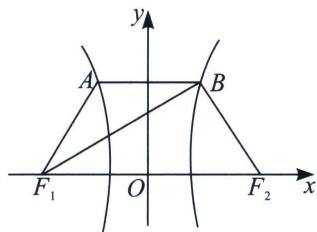

<!-- question-source:start -->
例10（2023·毕节市期末）如图，双曲线 $C: \frac{x^2}{a^2} - \frac{y^2}{b^2} = 1 (a > 0, b > 0)$ 的左、右焦点分别为 $F_1, F_2$ ，点 $A, B, M$ 在双曲线 $C$ 上，且四边形 $ABF_1F_2$ 为等腰梯形， $\overrightarrow{F_1F_2} = 2\overrightarrow{AB}, \overrightarrow{F_1M} = \frac{2}{3}\overrightarrow{MB}$ ，则双曲线 $C$ 的离心率为 \_\_\_\_.

<!-- question-source:end -->

![[高中/总复习/专题/2026版高中《mst老唐说题》圆锥曲线专题（数学）/上册/第02章_离心率/第一节_弦长体系下的焦长模型与焦比定理/三_焦点弦比值与离心率/例题/answers/Q00048406A1.md]]
