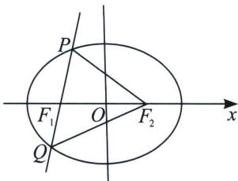

<!-- question-source:start -->
例11（2023·株洲一模）已知椭圆 $C: \frac{x^{2}}{a^{2}} + \frac{y^{2}}{b^{2}} = 1 (a > b > 0)$ 的左右焦点为 $F_{1}, F_{2}$ ，过 $F_{1}$ 的直线交椭圆 $C$ 于 $P, Q$ 两点，若 $\overrightarrow{PF_{1}} = \frac{4}{3} \overrightarrow{F_{1}Q}$ ，且 $|\overrightarrow{PF_{2}}| = |\overrightarrow{F_{1}F_{2}}|$ ，则椭圆 $C$ 的离心率为 \_\_\_\_.

<!-- question-source:end -->

![[高中/总复习/专题/2026版高中《mst老唐说题》圆锥曲线专题（数学）/上册/第02章_离心率/第一节_弦长体系下的焦长模型与焦比定理/三_焦点弦比值与离心率/例题/answers/Q00048407A1.md]]
