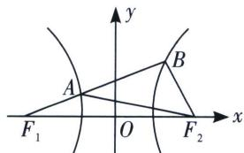

> [!faq]- 《圆锥曲线专题(上册)》例题解析
>
> > [!success]- **【答案】** $\frac{4\sqrt{3}}{7}$
>
> > [!note]- **【解析】**
> > 解析 令 $\angle AF_{1}F_{2} = \alpha = 30^{\circ}$ , $|BF_{1}| = \lambda |AF_{1}|$ , $e\cos \alpha = \frac{3}{2} = \frac{\lambda + 1}{\lambda - 1}$ , 所以 $\lambda = 5$ , $|BF_{1}| = \frac{(\lambda - 1)b^{2}}{2a} = \frac{2b^{2}}{a}$ $= 4a$ , 则 $|AF_{1}| = \frac{4a}{\lambda} = \frac{4}{5} a$ , $|AF_{2}| = 2a + \frac{4}{5} a = \frac{14}{5} a$ , $|BF_{2}| = 2a$ , 则 $|AB| = 4a - \frac{4}{5} a = \frac{16}{5} a$ ,
> >
> > 
> >
> > 在 $\triangle ABF_{2}$ 中， $\cos \angle AF_{2}B = \frac{|AF_{2}|^{2} + |BF_{2}|^{2} - |AB|^{2}}{2|AF_{2}||BF_{2}|} = \frac{4a^{2} + \frac{196}{25}a^{2} - \frac{256}{25}a^{2}}{2\times 2a\times\frac{14}{5}a} = \frac{1}{7}$ ，所以 $\sin \angle AF_{2}B = \frac{4\sqrt{3}}{7}$ ，故答案为 $\frac{4\sqrt{3}}{7}$ .
