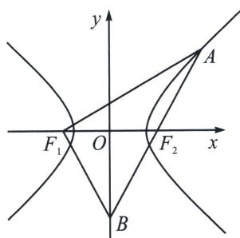

<!-- question-source:start -->
例5 (2023·新高考Ⅰ)已知双曲线 C: $\frac{x^{2}}{a^{2}} - \frac{y^{2}}{b^{2}} = 1 (a > 0, b > 0)$ 的左、右焦点分别为 $F_{1}$ ， $F_{2}$ 。点 A 在 C 上，点 B 在 y 轴上， $\overrightarrow{F_{1}A} \perp \overrightarrow{F_{1}B}$ ， $\overrightarrow{F_{2}A} = -\frac{2}{3}\overrightarrow{F_{2}B}$ ，则 C 的离心率为 \_\_\_\_.

<!-- question-source:end -->

![[高中/总复习/专题/2026版高中《mst老唐说题》圆锥曲线专题（数学）/上册/第02章_离心率/第一节_弦长体系下的焦长模型与焦比定理/二_焦点弦的化斜为直/例题/answers/Q00048401A1.md]]
