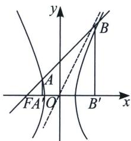

<!-- question-source:start -->
例6 (2022·浙江)已知双曲线 $\frac{x^{2}}{a^{2}} - \frac{y^{2}}{b^{2}} = 1 (a > 0, b > 0)$ 的左焦点为 $F$ , 过 $F$ 且斜率为 $\frac{b}{4a}$ 的直线交双曲线于点 $A(x_{1}, y_{1})$ , 交双曲线的渐近线于点 $B(x_{2}, y_{2})$ 且 $x_{1} < 0 < x_{2}$ . 若 $|FB| = 3 |FA|$ , 则双曲线的离心率是 \_\_\_\_.

<!-- question-source:end -->

![[高中/总复习/专题/2026版高中《mst老唐说题》圆锥曲线专题（数学）/上册/第02章_离心率/第一节_弦长体系下的焦长模型与焦比定理/二_焦点弦的化斜为直/例题/answers/Q00048402A1.md]]
