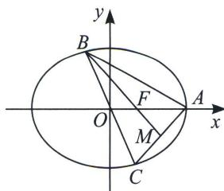

<!-- question-source:start -->
例7 (2023·南阳期末)如图, $\triangle ABC$ 内接于椭圆, 其中 $A$ 与椭圆右顶点重合, 边 $BC$ 过椭圆中心 $O$ , 若 $AC$ 边上中线 $BM$ 恰好过椭圆右焦点 $F$ , 则该椭圆的离心率为

<!-- question-source:end -->

![[高中/总复习/专题/2026版高中《mst老唐说题》圆锥曲线专题（数学）/上册/第02章_离心率/第一节_弦长体系下的焦长模型与焦比定理/二_焦点弦的化斜为直/例题/answers/Q00048403A1.md]]
