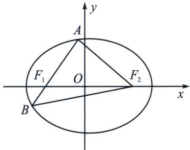
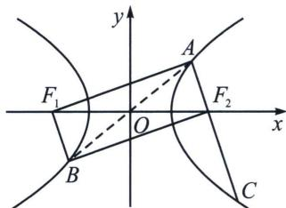

## 五、椭圆与双曲线的焦弦直角体与离心率

如左图所示，椭圆若 $AF_{2} \perp AB$ ，且 $\overrightarrow{AF_{1}} = \lambda \overrightarrow{F_{1}B}$ ， $\angle AF_{1}F_{2} = \alpha$ ，我们可以借助公式 $e\cos\alpha = \frac{|\lambda - 1|}{\lambda + 1}$ 可得 $\frac{c}{a} \cdot \frac{\lambda + 1}{2} \cdot \frac{b^{2}}{a} \cdot \frac{1}{2c} = \frac{\lambda - 1}{\lambda + 1}$ 来求出 a 和 b 的关系，由于 $\lambda > 1$ ，从而求出离心率.

如右图所示，若 $BF_{2} \perp AC$ ，AB 过原点，且 $\overrightarrow{AF_{2}} = \lambda \overrightarrow{F_{2}C} (0 < \lambda < 1)$ ，通过补全矩形，可得 $AF_{1} \perp AC$ ， $|AF_{2}| = \frac{\lambda + 1}{2} \cdot \frac{b^{2}}{a}$ ，借助公式 $e\cos\alpha = \frac{|\lambda - 1|}{\lambda + 1}$ 可得 $\frac{c}{a} \cdot \frac{\lambda + 1}{2} \cdot \frac{b^{2}}{a} \cdot \frac{1}{2c} = \frac{1 - \lambda}{\lambda + 1}$ 来求出 a 和 b 的关系，从而求出离心率.

注意 若直线 AB 交双曲线两支于 A、B 两点， $|\overrightarrow{AF}| = \lambda |\overrightarrow{FB}| (\lambda > 1)$ ，则 $|\overrightarrow{AF}| = \frac{\lambda - 1}{2} \frac{b^{2}}{a}$ ， $\angle AFF=\alpha$ 时， $e\cos\alpha=\frac{\lambda+1}{\lambda-1}$ ，本节前面已经论述.

![[高中/总复习/专题/2026版高中《mst老唐说题》圆锥曲线专题（数学）/上册/第02章_离心率/第一节_弦长体系下的焦长模型与焦比定理/五_椭圆与双曲线的焦弦直角体与离心率/例题/Q00048417.md]]
![[高中/总复习/专题/2026版高中《mst老唐说题》圆锥曲线专题（数学）/上册/第02章_离心率/第一节_弦长体系下的焦长模型与焦比定理/五_椭圆与双曲线的焦弦直角体与离心率/例题/Q00048418.md]]
![[高中/总复习/专题/2026版高中《mst老唐说题》圆锥曲线专题（数学）/上册/第02章_离心率/第一节_弦长体系下的焦长模型与焦比定理/五_椭圆与双曲线的焦弦直角体与离心率/例题/Q00048419.md]]
![[高中/总复习/专题/2026版高中《mst老唐说题》圆锥曲线专题（数学）/上册/第02章_离心率/第一节_弦长体系下的焦长模型与焦比定理/五_椭圆与双曲线的焦弦直角体与离心率/例题/Q00048420.md]]
![[高中/总复习/专题/2026版高中《mst老唐说题》圆锥曲线专题（数学）/上册/第02章_离心率/第一节_弦长体系下的焦长模型与焦比定理/五_椭圆与双曲线的焦弦直角体与离心率/例题/Q00048421.md]]
![[高中/总复习/专题/2026版高中《mst老唐说题》圆锥曲线专题（数学）/上册/第02章_离心率/第一节_弦长体系下的焦长模型与焦比定理/五_椭圆与双曲线的焦弦直角体与离心率/例题/Q00048422.md]]
