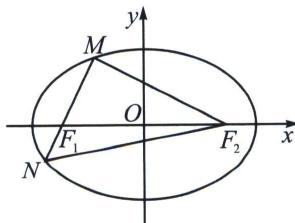

<!-- question-source:start -->
例19 (2024·长沙模拟)已知 $F_{1}, F_{2}$ 分别是椭圆 $C: \frac{x^{2}}{a^{2}} + \frac{y^{2}}{b^{2}} = 1 (a > b > 0)$ 的左, 右焦点, $M, N$ 是椭圆 $C$ 上两点, 且 $\overrightarrow{MF_{1}} = 2\overrightarrow{F_{1}N}, \overrightarrow{MF_{2}} \cdot \overrightarrow{MN} = 0$ , 则椭圆 $C$ 的离心率为
A. $\frac{3}{4}$ B. $\frac{2}{3}$ C. $\frac{\sqrt{5}}{3}$ D. $\frac{\sqrt{7}}{4}$

<!-- question-source:end -->

![[高中/总复习/专题/2026版高中《mst老唐说题》圆锥曲线专题（数学）/上册/第02章_离心率/第一节_弦长体系下的焦长模型与焦比定理/五_椭圆与双曲线的焦弦直角体与离心率/例题/answers/Q00048417A1.md]]
