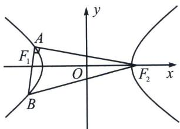

<!-- question-source:start -->
例20 (2024·荆州期末)如图, 已知 $F_{1}, F_{2}$ 分别是双曲线 $C: \frac{x^{2}}{a^{2}} - \frac{y^{2}}{b^{2}} = 1 (a > 0, b > 0)$ 的左、右焦点,过点 $F_{1}$ 的直线与双曲线 $C$ 的左支交于点 $A, B$ , 若 $\overrightarrow{AF_1} \cdot \overrightarrow{AF_2} = 0$ , $\overrightarrow{BF_1} = \frac{3}{2} \overrightarrow{F_1 A}$ , 则双曲线 $C$ 的渐近线方程为

A. $y = \pm \frac{\sqrt{6}}{3} x$ B. $y = \pm \frac{\sqrt{6}}{2} x$ C. $y = \pm \frac{2\sqrt{3}}{5} x$ D. $y = \pm \frac{5\sqrt{3}}{6} x$
<!-- question-source:end -->

![[高中/总复习/专题/2026版高中《mst老唐说题》圆锥曲线专题（数学）/上册/第02章_离心率/第一节_弦长体系下的焦长模型与焦比定理/五_椭圆与双曲线的焦弦直角体与离心率/例题/answers/Q00048418A1.md]]
