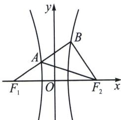

<!-- question-source:start -->
例21（2023·涟源市模拟）如图所示， $F_{1}$ ， $F_{2}$ 是双曲线 C: $\frac{x^{2}}{a^{2}} - \frac{y^{2}}{b^{2}} = 1 (a > 0, b > 0)$ 的左、右焦点，双曲线 C 的右支上存在一点 B 满足 $BF_{1} \perp BF_{2}$ ， $BF_{1}$ 与双曲线 C 的左支的交点 A 平分线段 $BF_{1}$ ，则双曲线 C 的离心率为（）

高中数学 新思路 圆锥曲线专题 A. 3 B. $2 \sqrt{3}$ C. $\sqrt{13}$ D. $\sqrt{15}$
<!-- question-source:end -->

![[高中/总复习/专题/2026版高中《mst老唐说题》圆锥曲线专题（数学）/上册/第02章_离心率/第一节_弦长体系下的焦长模型与焦比定理/五_椭圆与双曲线的焦弦直角体与离心率/例题/answers/Q00048419A1.md]]
