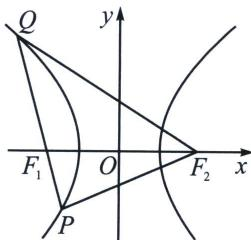

<!-- question-source:start -->
例23（2023·重庆模拟）已知双曲线 $C: \frac{x^2}{a^2} - \frac{y^2}{b^2} = 1 (a > 0, b > 0)$ 的左、右焦点分别为 $F_1, F_2$ ，过 $F_1$ 的直线交双曲线 $C$ 的左支于 $P, Q$ 两点，若 $\overrightarrow{PF_2^2} = \overrightarrow{PF_2} \cdot \overrightarrow{QF_2}$ ，且 $\triangle PQF_2$ 的周长为 $12a$ ，则双曲线 $C$ 的离心率为 ( )

A. $\frac{\sqrt{10}}{2}$ B. $\sqrt{3}$ C. $\sqrt{5}$ D. $2\sqrt{2}$

<!-- question-source:end -->

![[高中/总复习/专题/2026版高中《mst老唐说题》圆锥曲线专题（数学）/上册/第02章_离心率/第一节_弦长体系下的焦长模型与焦比定理/五_椭圆与双曲线的焦弦直角体与离心率/例题/answers/Q00048421A1.md]]
