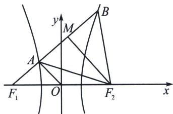

<!-- question-source:start -->
例24（2024·多选·南关区模拟）已知 $F_{1}$ , $F_{2}$ 分别为双曲线的左、右焦点, 过 $F_{1}$ 的直线交双曲线左、右两支于 $A$ , $B$ 两点, 若 $\triangle ABF_{2}$ 为等腰直角三角形, 则双曲线的离心率可以为 ( )
A. $\sqrt{6}+\sqrt{3}$ B. $\sqrt{3}$ C. $\sqrt{5+2\sqrt{2}}$ D. $\sqrt{5-2\sqrt{2}}$

<!-- question-source:end -->

![[高中/总复习/专题/2026版高中《mst老唐说题》圆锥曲线专题（数学）/上册/第02章_离心率/第一节_弦长体系下的焦长模型与焦比定理/五_椭圆与双曲线的焦弦直角体与离心率/例题/answers/Q00048422A1.md]]
