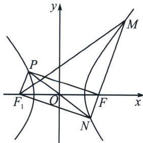

> [!faq]- 《圆锥曲线专题(上册)》例题解析
>
> > [!success]- **【答案】** D
>
> > [!note]- **【分析】**
> > 本题未单列分析。
>
> > [!note]- **【解析】**
> > 解析 设双曲线的左焦点为 $F_{1}$ , 连接 $PF 、 PF_{1} 、 NF_{1} 、 MF_{1}$ , 如图所示,
> > 
> > 又 O 为 PN 的中点，所以四边形 $PF_{1}NF$ 为矩形，设 $\angle MFx = \alpha, \lambda = \frac{|NF|}{|MF|} = \frac{1}{3}, e\cos\alpha = \frac{|\lambda - 1|}{\lambda + 1}$ 可得 $\frac{c}{a} \cdot \frac{\lambda + 1}{2} \cdot \frac{b^{2}}{a} \cdot \frac{1}{2c} = \frac{1 - \lambda}{\lambda + 1} \Rightarrow \frac{b^{2}}{a^{2}} = \frac{3}{2}$ ，即 $10a^{2} = 4c^{2}$ ，解得 $e = \frac{c}{a} = \frac{\sqrt{10}}{2}$ 。
> >
> > 故选 **D**.
