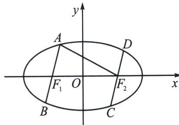

<!-- question-source:start -->
例25（2022·江西模拟）如图，椭圆 $M: \frac{x^2}{a^2} + \frac{y^2}{b^2} = 1 (a > b > 0)$ 的左、右焦点分别为 $F_1, F_2$ ，两平行直线 $l_1, l_2$ 分别过 $F_1, F_2$ 交 $M$ 于 $A, B, C, D$ 四点，且 $AF_2 \perp DF_2, |AF_2| = 4 |DF_2|$ ，则 $M$ 的离心率为（）

A. $\frac{1}{2}$ B. $\frac{\sqrt{3}}{2}$ C. $\frac{2}{3}$ D. $\frac{\sqrt{5}}{3}$
<!-- question-source:end -->

![[高中/总复习/专题/2026版高中《mst老唐说题》圆锥曲线专题（数学）/上册/第02章_离心率/第一节_弦长体系下的焦长模型与焦比定理/六_焦点弦的平行四边形对称化构造/例题/answers/Q00048423A1.md]]
