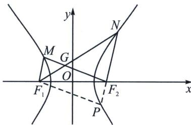

<!-- question-source:start -->
例26（2024·台州模拟）设 $F_{1}$ ， $F_{2}$ 是双曲线 $C: \frac{x^{2}}{a^{2}} - \frac{y^{2}}{b^{2}} = 1 (a > 0, b > 0)$ 的左、右焦点，点 $M$ ， $N$ 分别在双曲线 $C$ 的左、右两支上，且满足 $\angle MF_{2}N = \frac{\pi}{3}$ ， $\overrightarrow{NF_{2}} = 2\overrightarrow{MF_{1}}$ ，则双曲线 $C$ 的离心率为（）
A. 2 B. $\frac{7}{3}$ C. $\sqrt{3}$ D. $\frac{5}{2}$

<!-- question-source:end -->

![[高中/总复习/专题/2026版高中《mst老唐说题》圆锥曲线专题（数学）/上册/第02章_离心率/第一节_弦长体系下的焦长模型与焦比定理/六_焦点弦的平行四边形对称化构造/例题/answers/Q00048424A1.md]]
