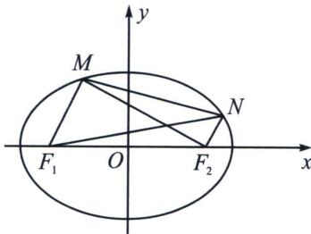
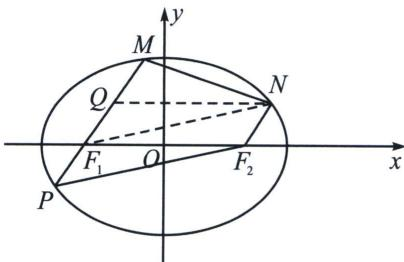

> [!faq]- 《圆锥曲线专题(上册)》例题解析
>
> > [!success]- **【答案】** $\frac{\sqrt{5}}{3}$
>
> > [!note]- **【解析】**
> > 解析 解法一：如左图所示，设 $M(x_{1},y_{1})$ ， $N(x_{2},y_{2})$ ，且 $F_{1}(-c,0)$ ， $F_{2}(c,0)$
> >
> > 
> >
> > 
> >
> > 由 $F_{1}M \parallel F_{2}N$ ， $F_{1}M = 2F_{2}N$ 得， $\overrightarrow{F_{1}M} = 2\overrightarrow{F_{2}N}$ ，所以 $\left\{\begin{aligned}x_{1}+c=2(x_{2}-c)\\ y_{1}=2y_{2}\end{aligned}\right.$ ，即 $\left\{\begin{aligned}x_{1}=2x_{2}-3c\\ y_{1}=2y_{2}\end{aligned}\right.$ ①，
> >
> > 又 $\overrightarrow{F_1N} \cdot \overrightarrow{MN} + \frac{a^2}{9} = |F_1F_2|^2$ ，可化为 $(x_2 + c)(x_2 - x_1) + y_2(y_2 - y_1) + \frac{a^2}{9} = 4c^2$ ，将①式代入得， $(x_2 + c)(3c - x_2) - y_2^2 + \frac{a^2}{9} = 4c^2$ ，即 $(x_2 + c)(x_2 - 3c) + y_2^2 + 4c^2 = \frac{a^2}{9}$ ，配方整理得， $(x_2 - c)^2 + y_2^2 = \frac{a^2}{9}$ ，
> >
> > 所以 $\left|F_{2}N\right|^{2}=\frac{a^{2}}{9}$ ，即 $\left|F_{2}N\right|=\frac{a}{3}$ ，则 $\left|F_{1}M\right|=\frac{2a}{3}$
> >
> > 解法二: 利用对称性, 延长 $M F_{1}$ 交椭圆于 $P$ , 取 $M F_{1}$ 中点 $Q$ , 则四边形 $P F_{1} N F_{2}$ 、 $Q F_{1} F_{2} N$ 均为平行四边形，利用极化恒等式， $\overrightarrow{F_1N} \cdot \overrightarrow{MN} = |F_1F_2|^2 - \frac{a^2}{9} = |NQ|^2 - |NF_2|^2 = |F_1F_2|^2 - |NF_2|^2$ ，故 $|F_2N| = \frac{a}{3}$ ， $|PF_1| = \frac{\lambda + 1}{2\lambda} \cdot \frac{b^2}{a} = \frac{3}{4} \cdot \frac{b^2}{a} = \frac{a}{3} \Rightarrow \frac{b^2}{a^2} = \frac{4}{9}$ ，所以 $e = \frac{c}{a} = \frac{\sqrt{5}}{3}$ 。故答案为 $\frac{\sqrt{5}}{3}$ 。
> >
> > 关于中点和对称，极化恒等式是一个特别好用的方法，下面这个难题就是通过极化恒等式能够巧妙解决。
