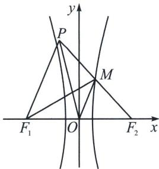

> [!faq]- 《圆锥曲线专题(上册)》例题解析
>
> > [!success]- **【答案】** A
>
> > [!note]- **【解析】**
> > 解析 如下图所示：
> >
> > 
> >
> > 解法一：因为 $|PF_{2}|=|F_{1}F_{2}|=2c$ ，O、M分别为 $F_{1}F_{2}$ 、 $PF_{2}$ 的中点，则 $|F_{2}M|=|F_{2}O|=c$ ，
> > 又因为 $|PF_{2}|=|F_{1}F_{2}|$ ， $\angle F_{1}F_{2}M=\angle PF_{2}O$ ，故 $\triangle F_{1}F_{2}M\cong\triangle PF_{2}O$ 所以 $|OP|=|F_{1}M|=|MF_{2}|+2a=c+2a$ ，由题意可知 $\tan\angle POF_{2}=-\frac{b}{a}$ ，故 $\angle POF_{2}$ 为钝角，
> > 所以， $\cos^{2}\angle POF_{2}=\frac{\cos^{2}\angle POF_{2}}{\cos^{2}\angle POF_{2}+\sin^{2}\angle POF_{2}}=\frac{1}{1+\tan^{2}\angle POF_{2}}=\frac{1}{1+\frac{b^{2}}{a^{2}}}=\frac{a^{2}}{c^{2}}$ 故 $\cos\angle POF_{2}=-\frac{a}{c}$ ，在 $\triangle POF_{2}$ 中， $|OP|=2a+c,\quad|OF_{2}|=c,\quad|PF_{2}|=2c$ 由余弦定理可得 $\cos\angle POF_{2}=-\frac{a}{c}=\frac{|OP|^{2}+|OF_{2}|^{2}-|PF_{2}|^{2}}{2|OP|\cdot|OF_{2}|}=\frac{(2a+c)^{2}+c^{2}-4c^{2}}{2c\cdot(2a+c)}$ ，解得 $e=\frac{c}{a}=4$ .
> > 解法二(极化恒等式): $\angle F_{1}MF_{2}=\theta$ ，利用对称性可知 $\angle F_{1}MF_{2}=\angle F_{2}OP$ ，所以 $\cos\theta=-\frac{a}{c}$ $\overrightarrow{MF_{1}}\cdot\overrightarrow{MF_{2}}=|MF_{1}||MF_{2}|\cos\theta=(c+2a)\cdot c\cdot\left(-\frac{a}{c}\right)=|OM|^{2}-c^{2}\Rightarrow|OM|^{2}=c^{2}-ac-2a^{2}=2ac+$ $\frac{|MF_{1}|^{2}+|MF_{2}|^{2}}{2}=\frac{(c+2a)^{2}+c^{2}}{2}=|OM|^{2}+c^{2}$ ，所以 $c^{2}-3ac-4a^{2}=(c-4a)(c+a)=0,\quad c=4a$ 或 $c=-a(\text{舍}),\quad e=\frac{c}{a}=4.$ 故选 A.
> >
> > $$
> > 2 a ^ {2}
> > $$
